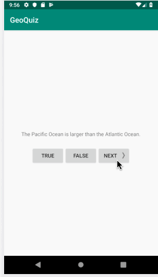

# GeoQuiz
An app that tests an users knowledge of geography.
Submitted by: **Laura Molina**

Time spent: **4** hours spent in total

## User Stories

The following **required** functionality is completed:

* [X] User can **view a series of questions**
* [x] User can **successfully select an answer (true/false)**
* [X] User's **can skip through questions** properly
* [x] User can **learn whether they chose the correct answer** 

## Video Walkthrough

Here's a walkthrough of implemented user stories:

GIF created with [LiceCap](http://www.cockos.com/licecap/).
